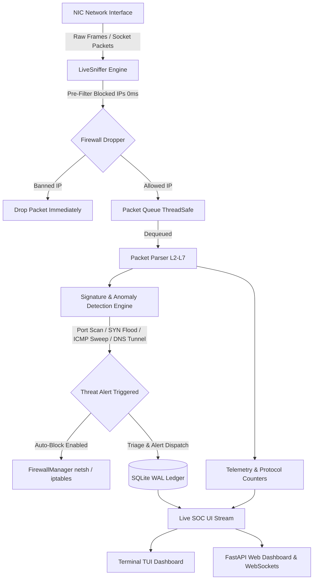

# 🛡️ CyberShield SOC: Multi-Platform Network Traffic Analyzer & Active Threat Defense System

[](https://www.python.org/)
[](https://opensource.org/licenses/MIT)
[](https://github.com/Sathvikpolipati)
[](https://github.com/Sathvikpolipati)

**CyberShield SOC** is an enterprise-grade, multi-platform Network Traffic Analyzer, Network Intrusion Detection System (NIDS), and interactive Security Operations Center (SOC) dashboard. Built with a **zero-driver native packet engine**, CyberShield captures, inspects, triages, and mitigates live cyber threats across **Windows**, **Linux**, **Android Termux**, and **macOS** with zero latency.

---

## 📑 Table of Contents

1. [Architectural Overview & Workflow Pipeline](#-architectural-overview--workflow-pipeline)
2. [Dual-Layer Active Threat Defense Engine](#-dual-layer-active-threat-defense-engine)
3. [Multi-Mode Modular Execution](#-multi-mode-modular-execution)
4. [Installation & Setup by Platform](#-installation--setup-by-platform)
   * [Windows (PowerShell / Windows Terminal / CMD / VS Code)](#-windows-powershell--windows-terminal--cmd--vs-code)
   * [Linux (Ubuntu, Debian, Kali Linux, Arch, Fedora)](#-linux-ubuntu-debian-kali-linux-arch-fedora)
   * [Android Termux (1-Click Automated Setup)](#-android-termux-1-click-automated-setup)
   * [macOS](#-macos)
5. [Complete Operational Command Manual](#-complete-operational-command-manual)
6. [Interactive Shell Commands Reference](#-interactive-shell-commands-reference)
7. [Automated Security Test Suite](#-automated-security-test-suite)
8. [License](#-license)

---

## 🏗️ Architectural Overview & Workflow Pipeline

CyberShield is structured with a modular, asynchronous, lock-free producer-consumer architecture designed to withstand continuous gigabit network floods without blocking UI rendering or packet capture:



### 🔬 Core Workflow Components:

1. **`core/sniffer.py` (Live Sniffer Engine)**:
   * Uses raw sockets or native Scapy socket binding to capture live packets from the active network interface.
   * Performs instant, zero-latency in-engine packet dropping against the `FirewallManager` cache before heavy parsing.
   * Asynchronously samples system socket states (`psutil`) every 1.0s to eliminate TCP driver lock contention.
2. **`core/parser.py` (Protocol Parser L2-L7)**:
   * Dissects packet layers including IPv4/IPv6, TCP, UDP, ICMP, DNS query payloads, HTTP methods, and HTTPS TLS SNI headers.
3. **`detectors/engine.py` (Threat Detection Engine)**:
   * Executes continuous sliding-window heuristics and signature analysis:
     * **Port Scan Detector** (`detectors/port_scan.py`): Detects horizontal and vertical port sweeps (>15 unique ports in 3.0s).
     * **SYN Flood Detector** (`detectors/syn_flood.py`): Identifies half-open connection denial-of-service bursts.
     * **ICMP Sweep Detector** (`detectors/icmp_sweep.py`): Catches ping sweeps across local subnet ranges.
     * **DNS Tunneling Detector** (`detectors/dns_tunnel.py`): Analyzes base64/hex subdomain entropy for data exfiltration.
4. **`core/firewall.py` (Active Defense Engine)**:
   * Synchronizes blocked IPs across in-memory fast lookups, SQLite persistence, and OS-level firewall rules (`netsh advfirewall` on Windows, `iptables` on Linux/Termux).
5. **`ui/tui.py` (Rich SOC Terminal Dashboard)**:
   * Native mouse wheel scrolling support via Windows Console API (`ReadConsoleInputW`) and POSIX SGR mouse tracking.
   * Auto-scaling layout dynamically adjusts to minimize, restore, and maximize actions.

---

## 🛑 Dual-Layer Active Threat Defense Engine

CyberShield implements a **two-tier mitigation barrier** to protect systems against malicious endpoints:

```
[ INCOMING TRAFFIC ]
        │
        ▼
 ┌───────────────────────────────────────────────────────────┐
 │ Tier 1: Zero-Latency In-Engine Fast Drop                  │
 │ Packets from banned IPs are dropped before parser/CPU cost│
 └─────────────────────────┬─────────────────────────────────┘
                           │
                           ▼
 ┌───────────────────────────────────────────────────────────┐
 │ Tier 2: Host OS Kernel Firewall Insertion                 │
 │ Windows: netsh advfirewall firewall add rule ...          │
 │ Linux/Termux: iptables -I INPUT -s <IP> -j DROP           │
 └───────────────────────────────────────────────────────────┘
```

---

## 🔀 Multi-Mode Modular Execution

CyberShield allows you to select exactly how you want to run the application:

| Mode | Entrypoint | Description |
| :--- | :--- | :--- |
| **Interactive Launcher** | `python launcher.py` | Interactive startup menu to choose TUI, Web, or Dual mode |
| **Terminal TUI SOC** | `python run_tui.py` (or `python main.py --ui terminal`) | Ultra-lightweight terminal SOC console |
| **Web Browser Suite** | `python run_web.py` (or `python main.py --ui web`) | Modern browser GUI with live charts & WebSockets |
| **Dual Mode** | `python main.py --ui both` | Live TUI in console + background Web server on port 8000 |
| **Android Termux** | `./termux_setup.sh` | Automated setup & touch-optimized mobile launcher |
| **Selective Downloader** | `python downloader.py` | Isolates and validates specific component configurations |

---

## 💻 Installation & Setup by Platform

### 🪟 Windows (PowerShell / Windows Terminal / CMD / VS Code)

```powershell
# 1. Clone repository
git clone https://github.com/Sathvikpolipati/Network-Traffic-Analyser-SOC.git
cd Network-Traffic-Analyser-SOC

# 2. Create and activate Python virtual environment
python -m venv venv
.\\venv\\Scripts\\activate

# 3. Install dependencies
pip install -r requirements.txt

# 4. Launch CyberShield (Interactive Menu)
python launcher.py

# Or launch directly into Terminal TUI:
python run_tui.py
```

---

### 🐧 Linux (Ubuntu, Debian, Kali Linux, Arch, Fedora)

```bash
# 1. Install prerequisites
sudo apt update && sudo apt install -y python3 python3-pip python3-venv libpcap-dev

# 2. Clone repository & setup virtual environment
git clone https://github.com/Sathvikpolipati/Network-Traffic-Analyser-SOC.git
cd Network-Traffic-Analyser-SOC
python3 -m venv venv
source venv/bin/activate
pip install -r requirements.txt

# 3. Launch with root privileges (Required for raw packet capture & iptables)
sudo ./venv/bin/python main.py
```

---

### 📱 Android Termux (1-Click Automated Setup)

```bash
# 1. Clone repository in Termux
git clone https://github.com/Sathvikpolipati/Network-Traffic-Analyser-SOC.git
cd Network-Traffic-Analyser-SOC

# 2. Make installer executable and run
chmod +x termux_setup.sh
./termux_setup.sh
```

---

### 🍎 macOS

```bash
# 1. Clone repository & setup
git clone https://github.com/Sathvikpolipati/Network-Traffic-Analyser-SOC.git
cd Network-Traffic-Analyser-SOC
python3 -m venv venv
source venv/bin/activate
pip install -r requirements.txt

# 2. Run CyberShield
sudo ./venv/bin/python main.py
```

---

## 📖 Complete Operational Command Manual

Type any command directly into the **`CyberShield> █`** interactive shell bar and press **Enter**:

### 🔍 SECTION 1: RECONNAISSANCE & SCANNING
* **`scan`** (aliases: `arp`, `netdiscover`): Triggers a live animated ARP radar sweep across your local subnet (`/24`) to discover active host IPs, MAC addresses, and vendor hardware.
* **`nmap <ip>`** (aliases: `inspect <ip>`, `ports <ip>`): Conducts a non-destructive TCP/UDP port audit on target IP within your subnet boundary (e.g. `nmap 192.168.149.1`).
* **`ifconfig`** (aliases: `ip`, `route`): Displays active network interface card name, local IPv4 address, MAC address, and subnet CIDR scope.

### 🛑 SECTION 2: THREAT DEFENSE & MITIGATION
* **`threats`** (aliases: `alerts`, `defense`): Opens full-screen interactive **Threat Intelligence & Defense Center** listing all detected anomalies.
* **`block <ip>`** (aliases: `ban <ip>`, `isolate <ip>`): Actively blocks attacker IP via Firewall (`netsh` / `iptables`) and drops incoming packets with zero latency in-engine (e.g. `block 192.168.149.200`).
* **`unblock <ip>`** (aliases: `allow <ip>`, `unban <ip>`): Removes the firewall block rule and restores network communication for the specified host.
* **`autoblock on` / `autoblock off`**: Enables/disables automated real-time banning of `CRITICAL` and `HIGH` severity threat sources.

### 📊 SECTION 3: PROTOCOL FLOW & TRAFFIC FILTERING
* **`filter <proto>`** (aliases: `grep <proto>`, `proto <proto>`): Filters the live packet stream and flow matrix by protocol (e.g. `filter HTTPS`, `filter DNS`, `filter TCP`, `filter UDP`, `filter ICMP`).
* **`clear`** (aliases: `reset`, `cls`): Clears the packet stream buffer and resets active protocol filters.
* **`dash`** (aliases: `home`, `main`): Returns to the primary 4-panel SOC Dashboard HUD.

### 💻 SECTION 4: SYSTEM PROCESS SOCKETS & OS INSPECTION
* **`ps`** (aliases: `top`, `sockets`, `sock`): Opens full-screen interactive **Process Sockets Inspector** showing active PIDs, application process names, local endpoints, remote endpoints, and socket states (`LISTEN`, `ESTABLISHED`, `TIME_WAIT`).

### 📡 SECTION 5: TOP TALKER ENDPOINTS & BANDWIDTH
* **`talkers`** (aliases: `who`, `endpoints`): Opens dedicated full-screen **Top Talkers Matrix** showing host scopes (Local, LAN, WAN), packet counts, transfer volume (MB/KB), and graphical flow activity bars.

### 📑 SECTION 6: REPORTING, SCROLLING & SYSTEM CONTROLS
* **`pdf`** (aliases: `export`, `report`): Compiles and exports an executive **Cyber Security PDF Audit Report** directly into your system's `Downloads/` directory.
* **`up [N]` / `down [N]`** (or **Mouse Wheel**): Scrolls active view history upward or downward.
* **`live`** (aliases: `tail`, `top`): Snaps view back to real-time incoming packet stream (● LIVE).
* **`kill`** (or **`Ctrl+C`**): Cleanly shuts down the sniffer, flushes buffers, and stops all background threads.

---

## ⌨️ Interactive Shell Commands Reference

| Command | Syntax | Operational Action |
| :--- | :--- | :--- |
| `help` | `help` | Toggles scrollable operational user manual |
| `threats` | `threats` | Opens full-screen Threat Intelligence & Defense Center |
| `block` | `block <ip>` | Bans attacker IP via Firewall + zero-latency packet drop |
| `unblock` | `unblock <ip>` | Unbans IP and restores network communication |
| `autoblock` | `autoblock on` | Toggles automated real-time banning for Critical threats |
| `filter` | `filter <proto>` | Filters live traffic by protocol (`HTTPS`, `DNS`, `TCP`, `UDP`) |
| `clear` | `clear` | Resets active protocol filters and clears packet buffer |
| `scan` | `scan` | Triggers animated subnet ARP sweep to discover LAN hosts |
| `nmap` | `nmap <ip>` | Audits open ports and service fingerprint on target host |
| `ifconfig` | `ifconfig` | Displays active NIC adapter, IP address, and subnet CIDR |
| `talkers` | `talkers` | Opens dedicated full-screen Top Talkers & Bandwidth Matrix |
| `ps` | `ps` | Opens full-screen Process Sockets & PID Inspector |
| `dash` | `dash` | Returns to the main 4-panel SOC Dashboard HUD |
| `pdf` | `pdf` | Exports executive Cyber Security PDF Report to Downloads |
| `up` / `down` | `up 5` / `down 5` | Scrolls view history (or use mouse wheel) |
| `live` | `live` | Snaps directly back to real-time incoming stream (● LIVE) |
| `kill` | `kill` | Stops sniffer and cleanly shuts down all background threads |

---

## 🧪 Automated Security Test Suite

CyberShield includes automated unit and integration tests verifying detection rules, packet parsers, database persistence, and subnet safety boundaries:

```bash
# Run pytest test suite
python -m pytest -v tests/
```

### ✅ Test Suite Coverage:
* `tests/test_detectors.py`: Port scan, SYN flood, ICMP sweep, DNS tunneling triggers.
* `tests/test_parser.py`: TCP, UDP, DNS, HTTPS, and ICMP protocol parsing.
* `tests/test_real_modules.py`: Interface detection, subnet boundary enforcement, database CRUD, and out-of-bound scan rejection.

---

## ⚖️ License

Distributed under the **MIT License**. See `LICENSE` for more information. Developed for enterprise network defense, security monitoring, and offensive/defensive cybersecurity research.
